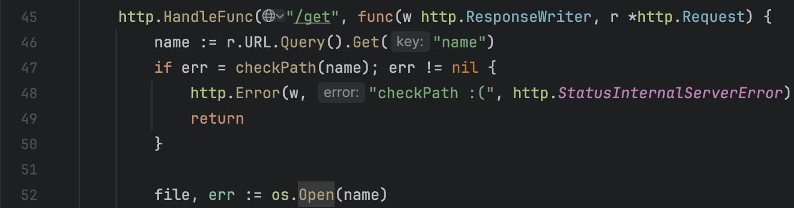
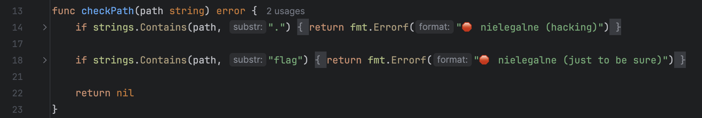
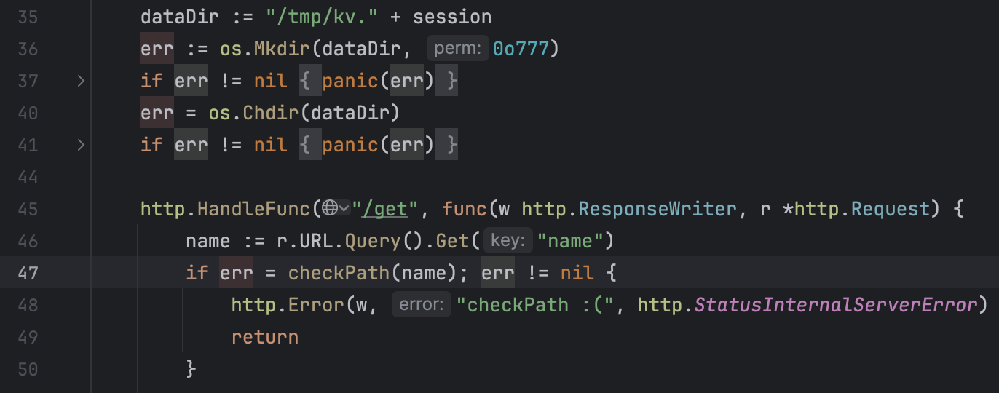

### Solution
First, we have an arbitrary file read in the `/get` handler on line 52:

but the `checkPath()` function does not allow us to access the flag.txt file:

In the same handler the `err` variable returned by the checkPath() function is assigned without declaration.
Furthermore, `err`'s scope is the whole session:

Therefore, we can trigger a race condition by spamming requests to get a legal file in parallel with requests to get `/home/ctf/flag.txt`